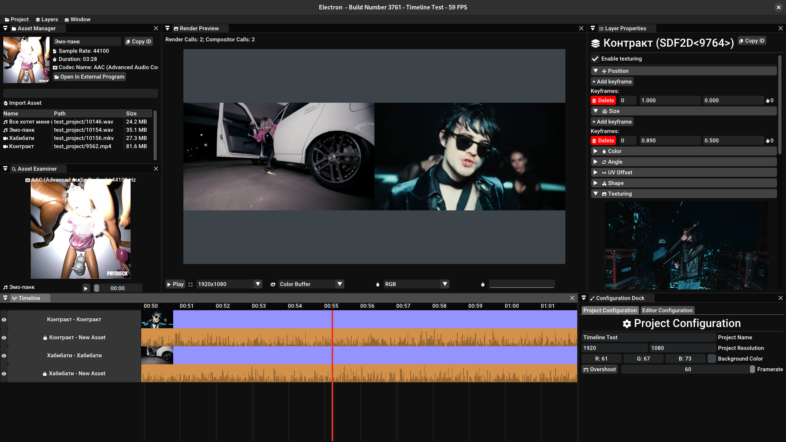

# <h1>
Electron
</h1>
<h1 align="center">! Deprecation Notice !</h1>

This video editor was deprecated in favor of [Raster](github.com/corgifist/raster). Raster's codebase is much more organized and written with durability and crash-safety in mind.

Why?
* Raster has a flexible serialization system. Electron doesn't know what serialization is 
* Raster has organized project structure. Electron's one is a mess
* Raster is much easier to maintain and add new features to

<h2 align="center">
   <a href="github.com/corgifist/raster">Just Use Raster</a>
</h2>

Advantages over other editors:
* Electron is Modular. Every part of editor (e.g. editor windows, audio backends, layers/effects) can be replaced/modified!
* Electron is Compatible to all Vulkan 1.3 Devices.
* Electron is Light. Editor and it's Subsystems altogether Barely Consumes 100 MB of RAM
* [WIP] Unique Render techniques (Render Targets, Layer Links and Snapshots) 

## Building
The Only Supported Platform for now is Linux.

Dependencies (Ubuntu apt packages):
* `python3-ply`, `python3-colorama` (for build system)
* `libglm-dev`, `binutils-dev` (for editor & subsystems)

Build manual:
* `python HashBuild/hash_build.py` to build project
* `python HashBuild/hash_build.py -dclean` to clean compilation objects

Run manual:
* `./electron`

Read `HashBuild/README.md` to get more info about HashBuild

## Screenshot Library

