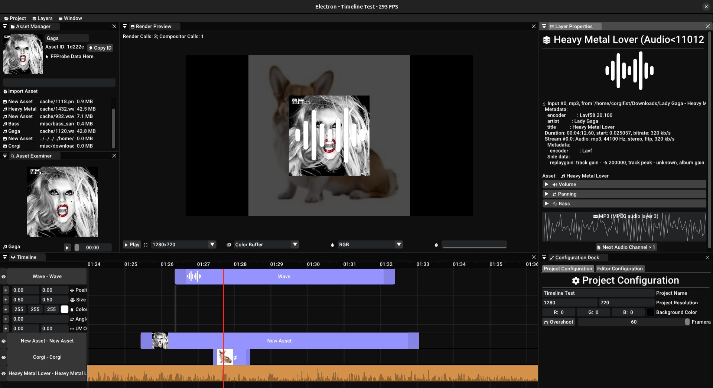

# <h1>
Electron [Heavy Work in Progress]
</h1>

Cross-platform Extensible OpenGL Video Editor!

Advantages over other editors:
* Electron is Modular. Every part of editor (e.g. editor windows, audio backends, layers/effects) can be replaced/modified!
* Electron is Compatible to all OpenGL 4.6 Devices. 
* Electron is Light. Editor and it's Subsystems altogether Barely Consumes 100 MB of RAM
* [WIP] Unique Render techniques (Render Targets, Layer Links and Snapshots) 

## Building
The Only Supported Platform for now is Linux.

Dependencies (Ubuntu apt packages):
* `python3-ply`, `python3-colorama` (for build system)
* `libglm-dev`, `libopenal-dev`, `binutils-dev`, `libcurl-dev` (for editor & subsystems)

Build manual:
* `python HashBuild/hash_build.py` to build project
* `python HashBuild/hash_build.py -dclean` to clean compilation objects

Run manual:
* `LD_LIBARY_PATH=libs ./electron`

Read `HashBuild/README.md` to get more info about HashBuild

## Screenshot Library

